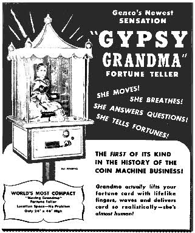

# Goblin Speaks Fortune Teller Project

Inspired by the penny arcade machines of the 1930s and novelty fortune teller machines like Zoltar, the Goblin Speaks project aims to deliver a framework of open source components and software which anyone can leverage to build their own working fortune teller machine.

These machines are designed to be "bartop" or "goblin" sized, rather than full life sized cabinets. (But really build it whatever size you like, I'm not your mom.)
The scope of project is to provide all of the mechanical aspects of the machine, such as animatronics, card dispensers software etc. 
Actual physical construction of the cabinet and any other accessories or decorations will be up to the builder.

The Goblin Speaks machine is built around the Raspberry Pi single board computer.

## Project State

We are still developing the first iteration of the machine.
Here is a video of the in progress prototype:

<iframe width="560" height="315" src="https://youtube.com/embed/22QMtMoQO5U?si=L_L5Q7h8ckz2mF6Z" title="Goblin Speaks" frameborder="0" allow="accelerometer; autoplay; clipboard-write; encrypted-media; gyroscope; picture-in-picture; web-share" allowfullscreen></iframe>

## Getting a Serial Number

Builders who complete a Goblin Speaks machine can apply for a serial number for the completed machine.
More details on this process will be available once the first iteration of the machine is completed.

For a machine to be completed it must meet the following criteria:

#### Use of Goblin Speaks Framework

The machine muse use at least some piece of the Goblin Speaks framework such as components, software, model files etc..
How much or how little the framework is used is up to you.
These machines can come in all shapes and sizes so there is no need to be picky on what is or is not considered a Goblin Speaks machine.
If the machine operates, meets these criteria, and you consider it a Goblin Speaks machine, than it is a Goblin Speaks machine.

#### Activation Mode

The machine must support some kind of activation mode.
This could be a coin mechanism, motion sensor, a button or whatever else you decide for your machine.

#### Play Mode

The machine must perform some kind of show for the player once activated.
This could mean activating an animatronic, playing audio, activating lights etc.

#### Dispense Object

The machine must dispense some kind of phsyical object to the player once the show is over.
For example a fortune card, small toy or token.

## Components

You can learn more about the available components used to build a Goblin Speaks machine [here](components.md).

## Software

The Goblin Speaks fortune teller system is designed to run on Raspberry Pi.
Learn more [here](software.md).

See the code on the github repository: https://github.com/gobbolab/goblin-speaks

## Contributing

If you make your own improved version of one of our components, have a new feature to add to the software, or have something unique for your machine that you want to be part of the project just open a PR with all the details. 
Code and 3D model files should be shared with a permissible license that allows others to use and iterate the designs.